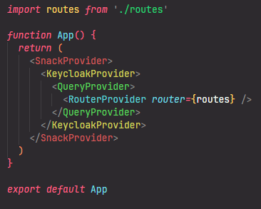

# 🎨 Colorize React Tags

A VS Code extension that colors JSX/TSX/HTML tag names based on their nesting level (or sequential order) for better code readability.

## Features

- 🏷️ Colors tag names (opening, closing, and self-closing tags) based on nesting depth or sequential order
- 🌈 Distinct colors for each level/pair (rotating hue)
- ⚡ Optimized for performance with debouncing and file size limits
- 🔄 Automatically updates as you type
- 🎯 Supports JavaScript, JSX, TypeScript, TSX, HTML syntax

## How It Works

The extension analyzes your code in real-time and assigns a unique color to each tag.

By default (`nesting` mode) the color is determined by the **nesting depth** — tags at the same depth share the same color. In `sequential` mode the color is determined by the **order of appearance** — every open/close pair gets its own unique color regardless of nesting.



## Installation

1. Go to the [Open VSX](https://open-vsx.org/extension/tazalov/colorize-react-tags) and download the extension (`.vsix` file).
2. Open Visual Studio Code.
3. Press `F1` or `Ctrl+Shift+P` (Windows/Linux) or `Cmd+Shift+P` (macOS)
4. Type and select *"Extensions: Install from VSIX..."*
5. In the file explorer that opens, navigate to the location where you downloaded the `.vsix` file.
6. Select the file and click *"Install"*.
7. Wait for the installation to complete. Once finished, you will see a notification confirming that the extension has been installed.
8. Refresh tag colors if needed (see Commands below).

## Usage

The extension activates automatically for supported file types. Tag names will be colored immediately.

### Commands

- `Colorize React Tags: Refresh` - Manually refresh tag colors (useful if colors get out of sync)

### Performance Features

- **Debounced updates**: Colors update 300ms after you stop typing
- **File size limit**: Files larger than 100K characters are skipped for performance

## Configuration

You can customize the following settings in your VS Code `settings.json`:

```json
{
    "colorizeReactTags.enabled": true,        // Enable/disable the extension
    "colorizeReactTags.maxFileSize": 100000,  // Max file size (characters)
    "colorizeReactTags.debounceDelay": 300,   // Debounce delay (ms)
    "colorizeReactTags.saturation": 60,       // Color saturation (0-100)
    "colorizeReactTags.lightness": 60,        // Color lightness (0-100)
    "colorizeReactTags.colorMode": "nesting"  // "nesting" | "sequential"
}
```

### Color modes

| Mode | Description |
|---|---|
| `nesting` | Tags at the same nesting depth share one color (default) |
| `sequential` | Every element gets its own color; the matching open and close tag of each pair share the same color |

## Requirements

- VS Code 1.109.0 or higher

## Known Issues

- Some template in JSX might not be fully supported

## Contributing

Found a bug? Have a feature request? [Open an issue](https://github.com/tazalov/vscode-colorize-react-tags/issues)

## License

MIT

---

**Enjoy!** 🎉